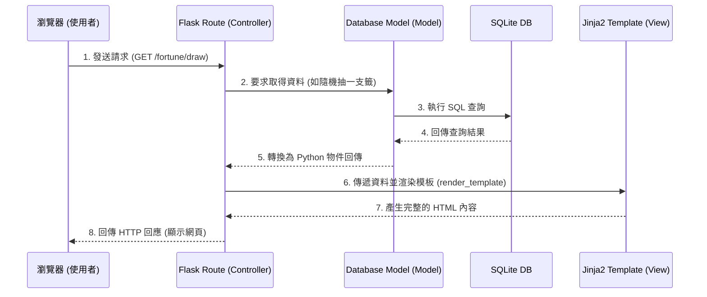

# 線上算命系統 — 系統架構文件

本文件描述線上算命系統的技術架構、資料夾結構與元件職責，作為開發階段的藍圖。

## 1. 技術架構說明

本系統採用傳統的伺服器端渲染（Server-Side Rendering, SSR）架構，前後端並未分離，這適合初學團隊快速開發與部署，同時保留了良好的架構可讀性。

### 選用技術

- **後端框架：Python + Flask**
  輕量級的微框架，彈性高，學習曲線平緩，非常適合作為快速建立 Web 應用的基礎。
- **視圖（View）：Jinja2 模板引擎**
  Flask 內建的模板引擎，可以用來動態生成 HTML 頁面，結合 HTML/CSS/JS 提供動態的網頁體驗。
- **資料庫：SQLite**
  無需獨立架設資料庫伺服器，資料儲存在單一檔案（`.db`），非常適合小型專案與開發階段的快速迭代。

### MVC 模式對應與職責

本專案採用類似 MVC（Model-View-Controller）的設計模式來組織程式碼：

- **Model（資料模型）：** 負責定義資料表結構（例如：使用者、歷史紀錄、捐獻紀錄）以及與資料庫的互動方式。
- **View（視圖）：** 位於 `templates/` 資料夾中的 Jinja2 模板，負責組合 HTML 結構並呈現資料給使用者看。
- **Controller（控制器/路由）：** 位於 `routes/` 的 Flask 路由函式（Python 程式碼），負責接收使用者的請求（例如造訪網址、送出表單），呼叫 Model 取得資料，並將資料傳遞給 View 進行渲染。

---

## 2. 專案資料夾結構

以下為建議的專案目錄結構，清晰分離邏輯、資料與靜態資源：

```text
web_app_development/
├── app.py                ← 應用程式的主要入口檔案，負責初始化與啟動 Flask 伺服器
├── requirements.txt      ← 記錄 Python 套件依賴版本（例如 Flask）
├── README.md             ← 專案介紹文件
│
├── docs/                 ← 開發設計檔案（PRD, 架構圖, 流程圖, ER圖 ...）
│   ├── PRD.md
│   └── ARCHITECTURE.md
│
├── database/             ← 資料庫相關資源
│   └── schema.sql        ← 建立資料庫資料表結構的初始 SQL 腳本
│
├── instance/             ← 運行期間產生的實例檔案（不會被加入版本控制）
│   └── database.db       ← SQLite 資料庫檔案
│
└── app/                  ← 應用程式核心程式碼
    ├── __init__.py       ← 實作 app 的建立（App Factory）
    ├── models/           ← 資料庫操作相關邏輯（M）
    │   ├── user.py
    │   ├── fortune.py
    │   └── donation.py
    ├── routes/           ← 處理 HTTP 請求與業務邏輯（C）
    │   ├── main.py       ← 首頁與綜合路由
    │   ├── auth.py       ← 註冊、登入邏輯
    │   ├── draw.py       ← 線上抽籤邏輯
    │   ├── tarot.py      ← 塔羅牌邏輯
    │   └── user.py       ← 個人資料、歷史紀錄
    ├── templates/        ← Jinja2 網頁模板檔案（V）
    │   ├── base.html     ← 所有頁面的共用基底（含導覽列、頁尾）
    │   ├── index.html    ← 首頁
    │   ├── auth/         ← 登入、註冊相關頁面
    │   ├── fortune/      ← 抽籤、塔羅牌、歷史紀錄頁面
    │   └── donate/       ← 捐獻與功德榜頁面
    └── static/           ← CSS, JavaScript, 圖片等前端靜態資源
        ├── css/          ← 樣式表
        ├── js/           ← 前端互動邏輯（例如抽籤動畫）
        └── img/          ← 塔羅牌圖案、系統圖示
```

---

## 3. 元件關係圖

以下展示了系統在處理使用者請求時，各個元件之間是如何互動的。

### 請求處理流程圖



---

## 4. 關鍵設計決策

1. **獨立架構（App Factory 與 Blueprint 原則）：**
   為了避免所有的路由都擠在一個巨大的 `app.py` 裡，我們將路由按功能（如登入、抽籤、塔羅）切分到 `app/routes/` 不同的檔案中。這不僅方便多人分工合作，也提高了程式碼的可維護性。

2. **繼承式 Jinja2 模板設計 (`base.html`)：**
   使用 Jinja2 的模板繼承機制。我們先建立一個 `base.html` 包含導覽列 (Navbar)、頁尾 (Footer) 及引入共用的 CSS/JS，其他所有頁面（如登入頁、抽籤結果頁）只需繼承 `base.html` 並填充屬於該頁面的內容區塊 (``)，大幅減少重複程式碼。

3. **密碼安全性處理：**
   使用者密碼絕對不會以明文形式儲存。我們將使用 Werkzeug 提供的密碼雜湊功能 (`generate_password_hash` 和 `check_password_hash`) 在 Model 層進行密碼加密後，才寫入 SQLite 資料庫，確保基本資訊安全。

4. **動畫與互動：**
   為了提供有趣的算命體驗，搖籤與塔羅翻牌的過程將在前端進行。會在 `static/js/` 中撰寫簡單的 JavaScript，當使用者點擊按鈕後觸發動畫，動畫結束後再向 Flask 發送請求或顯示結果，讓使用者不會覺得只有點擊並生硬跳轉。
