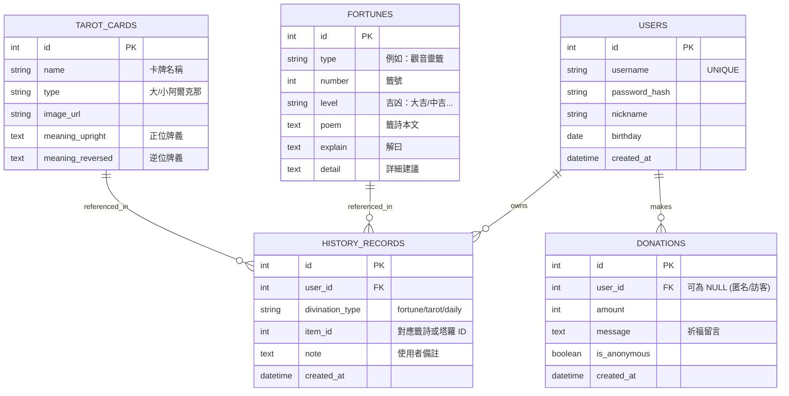

# 線上算命系統 — 資料庫設計文件 (DB Design)

本文件定義了「線上算命系統」的資料庫結構、實體關係圖 (ER Diagram) 以及各資料表的欄位規格。本系統使用 **SQLite** 作為資料庫。

## 1. 實體關係圖 (ER Diagram)

---

## 2. 資料表詳細說明

### 2.1 USERS (使用者表)
儲存使用者的基本帳號資訊與個人設定。

| 欄位名 | 型別 | 必填 | 說明 |
| :--- | :--- | :--- | :--- |
| id | INTEGER | 是 | Primary Key, 自動遞增 |
| username | TEXT | 是 | 登入帳號，具唯一性 |
| password_hash | TEXT | 是 | 經過 Werkzeug 加密後的密碼 |
| nickname | TEXT | 是 | 顯示暱稱 |
| birthday | TEXT | 否 | 使用者生日 (格式: YYYY-MM-DD) |
| created_at | DATETIME | 是 | 帳號建立日期，預設為當前時間 |

### 2.2 FORTUNES (籤詩表)
儲存系統中所有的籤詩資料（如觀音靈籤、月老籤等）。

| 欄位名 | 型別 | 必填 | 說明 |
| :--- | :--- | :--- | :--- |
| id | INTEGER | 是 | Primary Key, 自動遞增 |
| type | TEXT | 是 | 籤詩種類 (例如: '觀音靈籤') |
| number | INTEGER | 是 | 籤號 |
| level | TEXT | 是 | 吉凶評等 (例如: '大吉') |
| poem | TEXT | 是 | 籤詩本文 |
| explain | TEXT | 否 | 籤詩解曰 |
| detail | TEXT | 否 | 詳細各面向建議 (工作、感情等) |

### 2.3 TAROT_CARDS (塔羅牌表)
儲存塔羅牌的基本牌義資訊。

| 欄位名 | 型別 | 必填 | 說明 |
| :--- | :--- | :--- | :--- |
| id | INTEGER | 是 | Primary Key, 自動遞增 |
| name | TEXT | 是 | 塔羅牌名稱 (如: '愚者') |
| type | TEXT | 否 | 牌組類型 (如: '大阿爾克那') |
| image_url | TEXT | 否 | 圖片資源路徑 |
| meaning_upright | TEXT | 是 | 正位牌義 |
| meaning_reversed | TEXT | 是 | 逆位牌義 |

### 2.4 HISTORY_RECORDS (占卜紀錄表)
紀錄使用者每一次算命的操作結果。

| 欄位名 | 型別 | 必填 | 說明 |
| :--- | :--- | :--- | :--- |
| id | INTEGER | 是 | Primary Key, 自動遞增 |
| user_id | INTEGER | 是 | FK, 關聯 USERS.id |
| divination_type | TEXT | 是 | 占卜類型 ('fortune', 'tarot', 'daily') |
| item_id | INTEGER | 否 | 關聯 FORTUNES.id 或 TAROT_CARDS.id |
| note | TEXT | 否 | 使用者當下的問題或事後備註 |
| created_at | DATETIME | 是 | 紀錄時間 |

### 2.5 DONATIONS (捐獻紀錄表)
記錄使用者的打賞與祈福留言。

| 欄位名 | 型別 | 必填 | 說明 |
| :--- | :--- | :--- | :--- |
| id | INTEGER | 是 | Primary Key, 自動遞增 |
| user_id | INTEGER | 否 | FK, 關聯 USERS.id (訪客捐獻則為 NULL) |
| amount | INTEGER | 是 | 捐獻金額 |
| message | TEXT | 否 | 祈福留言內容 |
| is_anonymous | BOOLEAN | 是 | 是否在榜單顯示為匿名 |
| created_at | DATETIME | 是 | 捐獻時間 |

---

## 3. 設計考量
1. **時間戳記**: 所有資料表皆包含 `created_at`，使用 SQLite 的 `CURRENT_TIMESTAMP` 進行紀錄。
2. **安全性**: `users` 表格中僅儲存密碼的 Hash 值。
3. **靈活性**: `history_records` 透過 `divination_type` 區分不同的算命邏輯，方便未來擴充其他算命方式。
