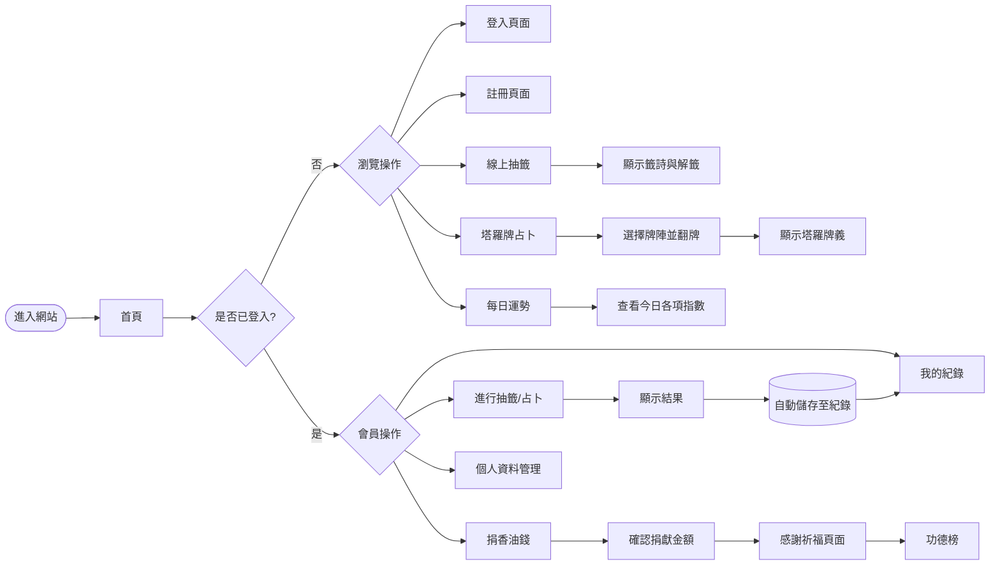
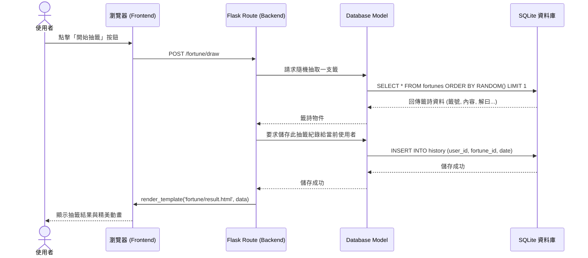

# 線上算命系統 — 流程圖與資料流文件

本文件描述線上算命系統的使用者操作流程（User Flow）以及核心功能的系統序列圖（Sequence Diagram），幫助開發團隊明確每一項功能的運作步驟與資料傳遞邏輯。

## 1. 使用者流程圖（User Flow）

這張圖展示了使用者從進入網站開始，可以進行的各種操作路徑與頁面跳轉。

---

## 2. 系統序列圖（Sequence Diagram）

以下以系統核心功能 **「已登入使用者進行線上抽籤並保存紀錄」** 為例，說明前端、後端與資料庫之間的資料傳遞流程。

---

## 3. 功能清單與請求對照表

本表格列出系統主要功能對應的 URL 路徑與 HTTP 請求方法（為接下來的路由設計提供基礎）。

| 模組 | 頁面名稱 / 功能 | URL 路徑 | HTTP 方法 | 說明 |
| :--- | :--- | :--- | :--- | :--- |
| **首頁** | 網站首頁 | `/` | `GET` | 系統功能總覽與導覽入口 |
| **帳號管理** | 註冊 | `/register` | `GET`, `POST` | 填寫表單(`GET`)並送出建檔(`POST`) |
| | 登入 | `/login` | `GET`, `POST` | 驗證帳密並建立 Session |
| | 個人資料 | `/profile` | `GET`, `POST` | 查看/修改帳號名稱或密碼 |
| **算命占卜** | 線上抽籤 | `/fortune/draw` | `GET`, `POST` | 進入抽籤頁面(`GET`)與執行搖籤(`POST`) |
| | 籤詩結果 | `/fortune/result/<id>` | `GET` | 顯示特定籤詩的解籤內容 |
| | 塔羅占卜 | `/tarot` | `GET`, `POST` | 選擇牌陣(`GET`)與洗牌翻牌(`POST`) |
| | 塔羅結果 | `/tarot/result/<id>` | `GET` | 顯示翻出的塔羅牌義 |
| | 每日運勢 | `/daily` | `GET` | 根據使用者登入資訊顯示今日運勢 |
| **紀錄** | 歷史紀錄 | `/history` | `GET` | 顯示登入使用者的過往算命與占卜紀錄 |
| **捐獻** | 捐香油錢 | `/donate` | `GET`, `POST` | 填寫金額留言(`GET`)與送出捐獻(`POST`) |
| | 功德榜 | `/donate/ranking` | `GET` | 顯示所有使用者的打賞排行與留言 |
